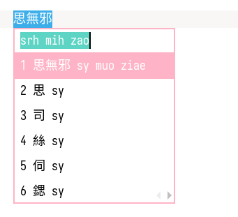
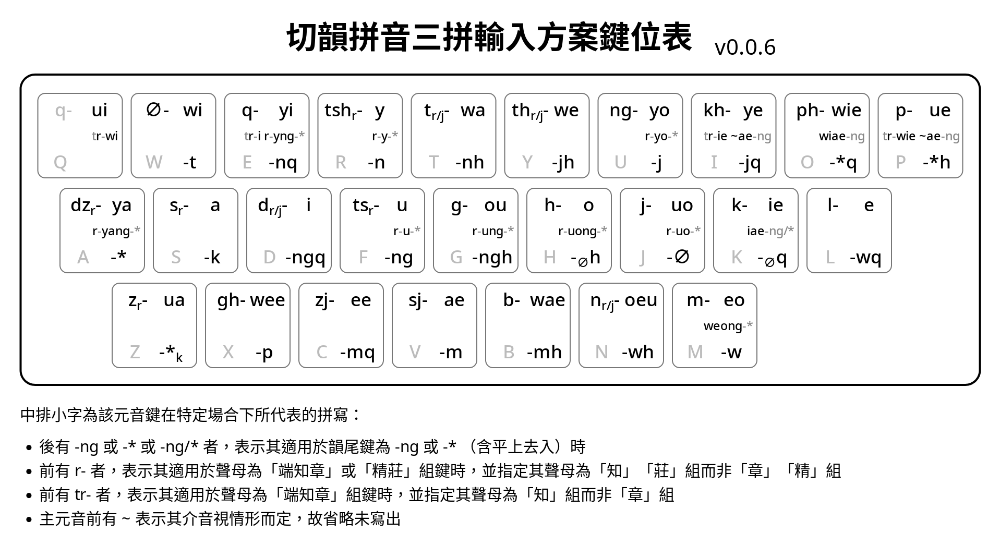

# RIME 切韻拼音三拼輸入法（α 測試版）

基於 [RIME 切韻拼音輸入方案](https://github.com/syimyuzya/rime-tupa)，用固定三鍵打出一字。

__注意__：此為 alpha 版，音到鍵的對應仍有些調整空間；鍵位排佈則為初稿，尚需實際測試。故先公開發佈方案，以供體驗使用。



## 安裝

需要先安裝 RIME 輸入法及切韻拼音輸入方案（及其所依賴的 [`rime-cantonese`](https://github.com/rime/rime-cantonese) 方案）。

手動安裝：將 `tupa_sp.schema.yaml` 放入 RIME 用戶目錄即可。

其他安裝方式：（TODO 待列出）

### 反查功能

與 RIME 拼韻拼音輸入法相仿，可按 <kbd>\`</kbd> 然後鍵入漢語拼音，或按 <kbd>~</kbd> 然後鍵入粵拼來反查切韻拼音。

## 鍵位表

此為簡表，具體鍵位說明見後文詳述。



其中[標為「-*」的韻尾鍵用法亦可點此預先了解](#special-final)。

## 聲母

25 鍵：

- 端知章（書船除外）組同鍵
- 精莊組同鍵

### 鍵位

| 左五         | 左四        | 左三         | 左二          | 左一        | 右一         | 右二         | 右三         | 右四         | 右五        |
| ------------ | ----------- | ------------ | ------------- | ----------- | ------------ | ------------ | ------------ | ------------ | ----------- |
| 影 q<br />Q  | 云 ∅<br />W | 影 q<br />E  | 清 tsh<br />R | 端 t<br />T | 透 th<br />Y | 疑 ng<br />U | 溪 kh<br />I | 滂 ph<br />O | 幫 p<br />P |
| 從 dz<br />A | 心 s<br />S | 定 d<br />D  | 精 ts<br />F  | 羣 g<br />G | 曉 h<br />H  | 以 j<br />J  | 見 k<br />K  | 來 l<br />L  |             |
| 邪 z<br />Z  | 匣 x<br />X | 船 zj<br />C | 書 sj<br />V  | 並 b<br />B | 泥 n<br />N  | 明 m<br />M  |              |              |             |

- 拼音為單字母的聲母，與字母鍵一致（惟影母除 Q 外亦可為 E）
- 滂在幫左 (O)、透在端右 (Y)、溪在見上 (I)
- 疑在溪左 (U)
- 云在 W、匣在 X
- 從在心邪間的 A
- 精在 F、清在精上 (R)
- 書在 V、船在書左 (C)

## 韻尾、四聲

25 鍵

- -0 平上去、-ng/k 平上去入（7 鍵）
- -j、-n/t（7 鍵）
- -w、-m/p（7 鍵）
- -*（4 鍵）

寫為「-*」的 4 鍵為特殊韻尾鍵，和特定元音鍵形成固定組合（詳見後面元音表）。

### 鍵位

| 左五                 | 左四                | 左三                  | 左二                 | 左一                  | 右一                | 右二               | 右三                | 右四                 | 右五                 |
| -------------------- | ------------------- | --------------------- | -------------------- | --------------------- | ------------------- | ------------------ | ------------------- | -------------------- | -------------------- |
| <br />Q              | N入<br />-t<br />E  | N上<br />-nq<br />W   | N平-n<br />R         | N去<br />-nh<br />T   | J去<br />-jh<br />Y | J平<br />-j<br />U | J上<br />-jq<br />I | \*上<br />-*q<br />O | \*去<br />-*h<br />P |
| \*平<br />-*<br />A  | NG入<br />-k<br />D | NG上<br />-ngq<br />S | NG平<br />-ng<br />F | NG去<br />-ngh<br />G | ∅去<br />-∅h<br />H | ∅平<br />-∅<br />J | ∅上<br />-∅q<br />K | W上<br />-wq<br />L  |                      |
| \*入<br />-*k<br />Z | M入<br />-p<br />C  | M上<br />-mq<br />X   | M平<br />-m<br />V   | M去<br />-mh<br />B   | W去<br />-wh<br />N | W平<br />-w<br />M |                     |                      |                      |

```
Q    W E R T       Y U I    O P
     入上平去<n  j>去平上 *>上去
A    S D F G       H J K    L
平<* 入上平去<ng 0>去平上 w>上
Z    X C V B       N M
入<* 入上平去<m  w>去平
```

- 中間部分三排對應韻尾三類，左手陽聲韻，右手陰聲韻（惟 w 尾上聲挪至旁邊 L）
- 「-*」尾四鍵均在邊緣

## 元音

26 鍵

| 三A<br />章、精           | 三B或知組<br />知、莊          | 三C<br />章、精          | 一四等<br />端、精      | 二等<br />知（端併入）、莊 |
| ------------------------- | ------------------------------ | ------------------------ | ----------------------- | -------------------------- |
|                           |                                | ya<br />接 -*: 知莊-yang | a                       | ae                         |
|                           |                                | ua                       | wa                      | wae                        |
| ie<br />接 -ng/*: iae(ng) | ye (知-ie)<br />接 -ng: yaeng  |                          | e                       | ee                         |
| wie<br />接 -ng: wiaeng   | ue (知-wie)<br />接 -ng: uaeng |                          | we                      | wee                        |
|                           |                                | yo<br />接 -*: 知莊-yo   | eo<br />接 -*: weong    | oeu                        |
|                           |                                | uo<br />接 -*: 知莊-uo   | o<br />接 -*: 知莊-uong |                            |
| i                         | yi (知-i)<br />接 -*: 知莊-yng | y<br />接 -*: 知莊-y     |                         |                            |
| wi                        | ui (知-wi)                     | u<br />接 -*: 知莊-u     | ou<br />接 -*: 知莊-ung |                            |

- iae、yae、wiae、uae 併入 ie、ye、wie、ue，靠 -ng 尾區分（麻三則用 -* 尾區分）
- 「端知章」「精莊」鍵，拼三AC兩欄時默認為章、精，拼三B一欄時默認為知、莊，但通過「-*」韻尾鍵可改變搭配

### 「-*」尾用法

1. 調整聲母搭配：
   - 主要 3C 元音 yo/uo/y/u 後接 -* 時為 -∅ 尾，並由原先拼章精組改為拼知莊組
   - ya 後接 -* 為 -ng 尾，並改拼知莊組
2. 調整等第及聲母搭配
   - 通攝 ung、uong 欲拼知莊組，用對應的一等元音 ou、o 接 -* 尾
   - 蒸韻 yng 欲拼知莊組，用對應的B類元音 yi 接 -* 尾
3. 調整介音：
   - 麻三 iae 為 ie 接 -* 尾，與清開 iaeng 為 ie 接 -ng 平行
   - 登合 weong 為 eo 接 -* 尾


### <a name="special-final"></a>如何掌握「-*」尾用法？

<b>「-*」尾用法不用一上來就全記住！</b>只需要以下三條處理原則就可以<b>立即開始打字</b>，並在實際使用中漸漸掌握用法：

1. __章精變知莊__：想打「知」「莊」組聲母卻打出「章」「精」組，說明此處可能就是「-\*」尾派上用場的時候！如果想打的元音不分AB類重紐，就換用「-\*」韻尾鍵試試吧！（當然，分重紐的元音就只需換B類即可切換聲母，不用換韻尾）
   - 例：初學三拼時想試着打「張」tryang，敲 t-ya-ng (<kbd>T</kbd>-<kbd>T</kbd>-<kbd>F</kbd>) 發現打出的是「章」tjyang，且 ya 不分重紐，那麼改打 t-ya-* (<kbd>T</kbd>-<kbd>T</kbd>-<kbd>A</kbd>) 就能成功打出「張」
   - 例二：想打「使」sryq，敲 s-y-q (<kbd>S</kbd>-<kbd>R</kbd>-<kbd>K</kbd>) 發現打出的是「萆」syq，且 y 不分重紐AB，改打 s-y-*q (<kbd>S</kbd>-<kbd>R</kbd>-<kbd>Z</kbd>) 就能成功打出「使」
2. __-ng 尾可能換元音__：打 -ng 尾三等字，照着上一條做，卻打出了不帶韻尾的字，說明除了韻尾鍵用「-*」外，還需要換用與其最接近的相鄰元音鍵（鍵盤上也是相鄰的），這種情況只有三個韻出現：ung 用 ou 鍵、uong 用 o 鍵、yng 用 yi 鍵就可以了！
   - 例：初學三拼想打「中」trung，敲 t-u-ng (<kbd>T</kbd>-<kbd>E</kbd>-<kbd>F</kbd>) 發現打出的是「終」tjung，改打 t-u-* (<kbd>T</kbd>-<kbd>E</kbd>-<kbd>A</kbd>) 發現打出的是「啁」tru 沒有 -ng 尾，那麼再改 t-ou-* (<kbd>T</kbd>-<kbd>W</kbd>-<kbd>A</kbd>) 就能成功打出「中」
   - 例二：想打「僜」trhyng，敲 th-y-ng (<kbd>Y</kbd>-<kbd>R</kbd>-<kbd>F</kbd>) 發現打出的是「稱」tjhyng，改打 th-y-* (<kbd>Y</kbd>-<kbd>R</kbd>-<kbd>A</kbd>) 發現打出的是「癡」trhy 沒有 -ng 尾，那麼再改 th-yi-* (<kbd>Y</kbd>-<kbd>F</kbd>-<kbd>A</kbd>) 能成功打出「僜」
3. __最後兩韻直接記__：最後就只剩下麻三 iae 用 ie-\*，以及登合 weong 用 eo-\* 這兩個特別組合了，請直接記住就好。

### 特殊處理

- 「地」dih 單獨編碼為「d-i-jh」，以區別於「視」（常母，d-i-∅h）
- 「怎」tsoimq（精開一侵上）該音不在切韻音系中，其元音寄於最不常用的 ui 鍵，編碼為「ts-ui-mq」

### 鍵位

| 左五      | 左四       | 左三      | 左二      | 左一       | 右一       | 右二      | 右三      | 右四       | 右五      |
| --------- | ---------- | --------- | --------- | ---------- | ---------- | --------- | --------- | ---------- | --------- |
| ui<br />Q | wi<br />W  | yi<br />E | y<br />R  | wa<br />T  | we<br />Y  | yo<br />U | ye<br />I | wie<br />O | ue<br />P |
| ya<br />A | a<br />S   | i<br />D  | u<br />F  | ou<br />G  | o<br />H   | uo<br />J | ie<br />K | e<br />L   |           |
| ua<br />Z | wee<br />X | ee<br />C | ae<br />V | wae<br />B | oeu<br />N | eo<br />M |           |            |           |

- 左手中排食指為 u，其上為對應的開口 y，其右為對應的一等 ou
  - 右手對稱，中排食指為 uo，其上為 yo，其左為 o，其下則為 o 對應的開口 eo
- 左手中排中指為 i，其正上開始往左分別為 yi、wi、ui
  - 右手對稱，中排中指為 ie，其上開始往右分別為 ye, wie, ue
- 左手中排無名指為 a，其合口 wa 在食指右上
  - 右手對稱，中排無名指為 e，其合口 we 在食指左上
  - 左手小指（即 a 左邊）為 ya，合口 ua 在其下
- 二等元音在下排連續五鍵

## 聲明

本方案（及其他類似方案）僅為基於切韻拼音所設計的便捷輸入方案，屬於其衍生品。此類輸入法亦非切韻拼音規範所涉及的領域，故本方案（及其他類似方案皆）不具有和切韻拼音同等的通用規範地位，亦不會作為切韻拼音的「指定配套方案」等。
